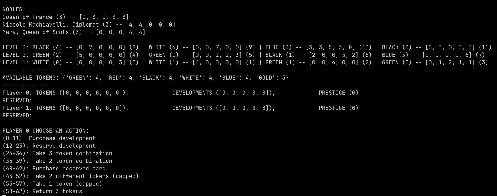

# SplendorRL
SplendorRL is a framework to train agents to play the board game 
[Splendor](https://boardgamegeek.com/boardgame/148228/splendor) 
using multi-agent reinforcement learning (MARL). 
It includes the environment`splendor_env` which was built using the PettingZoo framework.



## Training 
Use the command line interface to train a model on the splendor environment.

```bash
python3 splendor/main.py -h
```

```
usage: splendor [-h] [-e ENVIRONMENT] [-a {reinforce}] [-n {mlp}] [-l LEARNING_RATE] [-p EPOCHS] [-b BATCH_SIZE] [-r]

options:
  -h, --help                            show this help message and exit
  -e, --environment=[str]               Environment to run
  -a, --algorithm={reinforce}           Algorithm to use
  -n, --network={mlp}                   Policy network architecture
  -l, --learning-rate=[float]           Learning rate for optimizer
  -p, --epochs=[int]                    Number of training epochs
  -b, --batch-size=[int]                Number of timesteps per policy update
  -r, --render                          If set, renders the environment during training
```

Currently, the only supported algorithms are:
- REINFORCE

## Manually playing
To run the splendor environment and play a game against another user, use the `cli.py` file.
```bash
python3 splendor/cli.py
```

By default, this manual environment does not check the validity of your moves. Thus, it will
allow you to run illegal moves (ex: taking a green token when there are none available).

## Implementation Details
SplendorEnv is built using the PettingZoo framework. Below are the native implementations of 
the observation and action space. However, we wrap the environment in wrappers (defined in
`environment/env.py`) that flatten both spaces into discrete spaces for ease of use with
the training algorithms.

#### Observation Space

The observation space is a nested dictionary with the following structure:

- `available_tokens`: `MultiDiscrete([6, 6, 6, 6, 6, 6])`  
  Tokens available in the shared pool.

- `available_nobles`: `Box(low=0, high=4, shape=(3, 6), dtype=int)`  
  Encodes the visible noble tiles.

- `available_cards`: `Box(low=0, high=10, shape=(12, 12), dtype=int)`  
  Encodes the grid of available development cards.

- `player`: `Dict`  
  The current player's state:
  - `prestige`: `Box(low=0, high=40, dtype=int)`
  - `tokens`: `MultiDiscrete([6, 6, 6, 6, 6, 6])`
  - `developments`: `MultiDiscrete([20, 20, 20, 20, 20])`
  - `reserved_cards`: `Box(low=0, high=10, shape=(3, 12))`

- `opponents`: `Tuple` of `Dict`s (length = `num_players - 1`)  
  Each opponent has:
  - `prestige`: `Box(low=0, high=40, dtype=int)`
  - `tokens`: `MultiDiscrete([6, 6, 6, 6, 6, 6])`
  - `developments`: `MultiDiscrete([20, 20, 20, 20, 20])`
  - `reserved_cards`: `Box(low=0, high=10, shape=(3, 12))`

#### Action Space

The action space is a `OneOf` composite space, consisting of the following discrete sub-actions:

1. `Discrete(10)` – Choose 3 different tokens  
2. `Discrete(5)` – Choose 2 tokens of the same type  
3. `Discrete(12)` – Reserve a card from the board  
4. `Discrete(12)` – Purchase a card from the board  
5. `Discrete(3)` – Purchase a reserved card  
6. `Discrete(10)` – Choose 2 different tokens (with cap enforcement)  
7. `Discrete(5)` – Choose 1 token (with cap enforcement)  
8. `Discrete(10)` – Return 3 tokens  

At each timestep, the agent selects one of these sub-actions and then provides an action within that discrete subspace.

## Todo
- Implement action masking for manually playing.
- Ability to use config files instead of command line arguments
- `Match` data structure that holds match information for debugging

